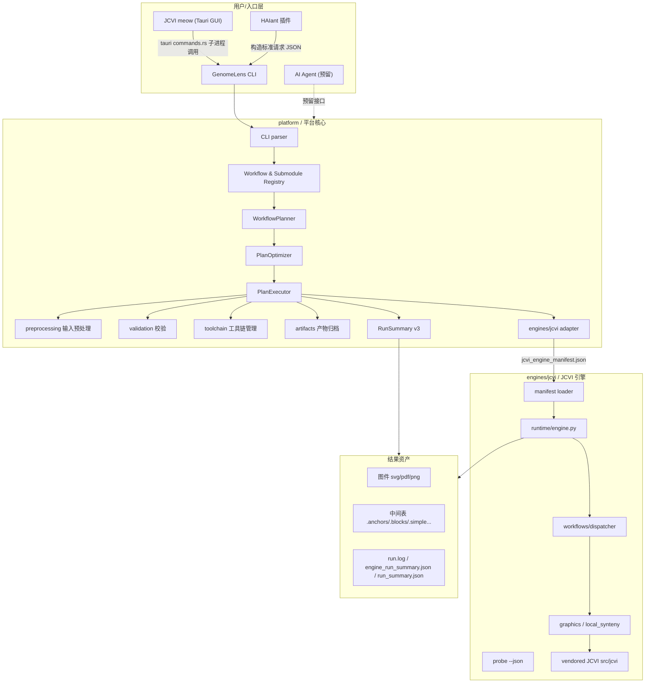
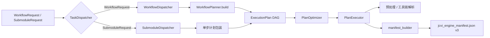
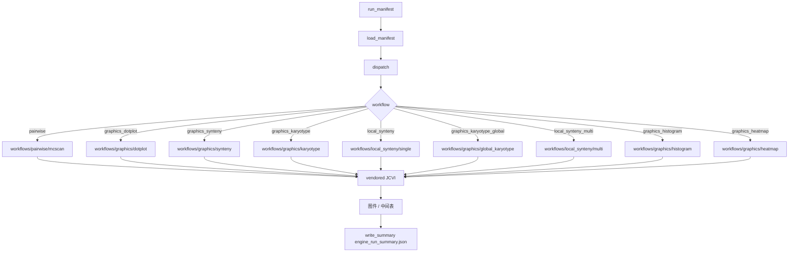
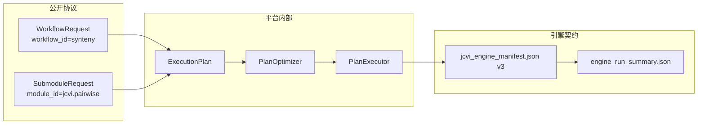
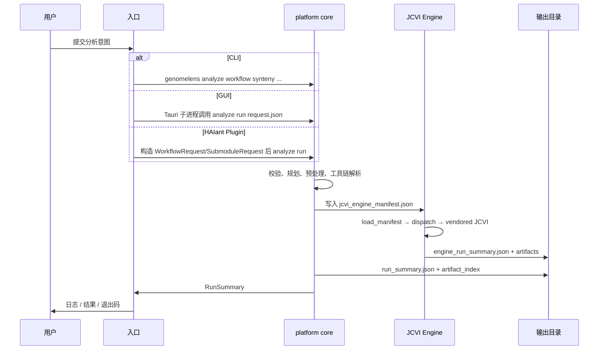
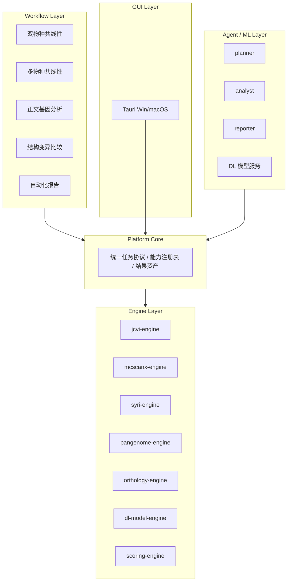

# GenomeLens 架构研究报告

> 报告日期：2026-06-25  
> 面向分支：`main`（v1.0.0-preview-1）  
> 报告范围：对 GenomeLens 仓库整体架构、模块边界、核心协议、调用链、交付方式进行全景式梳理，并给出树状图与流程图。

---

## 1. 项目概览

GenomeLens 是面向 **Windows-first** 交付的本地比较基因组学平台，当前版本 **v1.0.0-preview-1**，是 1.0.0 正式发布前的预览阶段。它的核心目标是在 Windows 上**本地、轻量、快捷、高效、真实**地整合 JCVI（及后续扩展）能力。

| 维度 | 当前状态 |
|---|---|
| 产品形态 | CLI + Tauri 桌面 GUI（JCVI meow）+ HAIant 插件 |
| 平台版本 | `platform` 1.0.0-preview-1；`gui` 1.0.0-preview-1；`jcvi-genomelens` 1.0.0-preview-1 |
| 主要语言 | Python 3.12（平台 + 引擎）、Rust（Tauri 后端）、TypeScript/React（前端）|
| 运行时工具链 | BLAST+、jcvi-genomelens 引擎、ImageMagick（可选）|
| 交付方式 | PyInstaller 打包的 Windows 可执行文件 + 独立 HAIant 插件 zip |

两种互补的交付方式：

1. **一站式工作流（One-Stop Workflow）**：一个命令完成从输入发现、预处理、比对、MCscan 到出图的全链路。
2. **可编排子模块（Composable Sub-Module）**：每个 JCVI 能力以显式输入/输出端口暴露，可独立运行，也可通过脚本、批处理、插件或 GUI 积木式组合。

---

## 2. 架构总览

### 2.1 核心原则（来自 `docs/开发手册/架构调整/最终架构目标.md`）

- **平台核心单一**：`platform/` 是唯一的任务编排、协议解释、产物治理中心。
- **引擎能力插件化**：`engines/` 下可并列接入多个引擎，统一通过 `probe` / `run` / manifest schema / result schema / artifact declaration 接入。
- **任务协议稳定**：CLI、GUI、插件、Agent 只提交 `WorkflowRequest` 或 `SubmoduleRequest`。
- **结果资产可追踪**：输出不只是散文件，而是带 `artifact_id`、`produced_by`、`input_refs` 等元数据的结果资产。
- **GUI 只是外壳**：Tauri 层不实现分析算法，不持有核心业务规则。
- **Agent 是调度者**：未来 Agent 通过平台接口调度，不直接绕过平台执行脚本。

### 2.2 全局架构图



### 2.3 模块职责速查表

| 模块 | 职责 | 当前状态 |
|---|---|---|
| `platform/` | CLI、输入校验、预处理、工作区布局、工具链发现、engine manifest 生成、结果归档、能力注册表 | 已实现 |
| `engines/jcvi/` | 当前唯一正式引擎，内置 vendored JCVI，只暴露 `probe` 和 `run` | 已实现 |
| `engines/` | 引擎层目录，未来 `mcscanx`、`syri`、`pangenome`、`orthology`、`dl-model` 等平级接入 | 预留 |
| `gui/tauri/` | Tauri v2 + React 18 桌面 GUI，定位为外壳 | 先行版已实现 |
| `integrations/haiant_plugin/` | HAIant 插件适配器，构造标准请求调用平台 | 已实现 |
| `agents/` | AI Agent 层 | 路线图预留 |
| `toolchains/` | 本地运行时缓存（BLAST+、ImageMagick、jcvi-genomelens） | 不进入 Git 跟踪 |
| `scripts/` | PowerShell 构建脚本：工作区引导、GUI 构建、分包构建、引擎插件构建 | 已实现 |

---

## 3. 目录结构

> 以下树状图已忽略 `node_modules`、`.git`、`target`、`.build`、`dist`、`app` 发布包、`toolchains/blast` 与 `toolchains/imagemagick` 二进制缓存、`.pytest_cache`、`.ruff_cache`、`.idea`、`.vscode`、`.claude`、`.work` 等目录。

### 3.1 顶层目录树

```text
GenomeLens/
├── .github/
│   └── workflows/
│       ├── gui-ci.yml
│       ├── release-smoke.yml
│       └── windows-ci.yml
├── agents/
│   └── README.md
├── docs/
│   ├── 使用方法/
│   │   ├── JCVI能力与配置.md
│   │   ├── SubmoduleRequest JSON.md
│   │   ├── WorkflowRequest JSON.md
│   │   ├── 子模块手册.md
│   │   ├── 工作流组合.md
│   │   └── 配置文件说明.md
│   ├── 历史/
│   │   ├── 开发手册/
│   │   ├── 更新/
│   │   ├── AnalysisRequest JSON.md
│   │   ├── CLI.md
│   │   ├── DELIVERY.md
│   │   ├── GitHub历史归档与全新开始计划.md
│   │   ├── JCVI能力与配置.md
│   │   ├── One-Step-SyntenyLens-参数手册.md
│   │   ├── README.md
│   │   ├── 一些缺失的需求项.md
│   │   ├── 代码整洁改进建议.md
│   │   ├── 代码风格规范.md
│   │   ├── 使用方法README.md
│   │   ├── 分析命令改版计划.md
│   │   ├── 开发过程.md
│   │   ├── 施工计划.zip
│   │   ├── 用户手册.md
│   │   ├── 结构优化计划.md
│   │   ├── 能力接入规则.md
│   │   ├── 计划更新.md
│   │   ├── 计划更新的内容.md
│   │   ├── 项目介绍.md
│   │   └── 项目改进意见.md
│   ├── 开发手册/
│   │   ├── GUI先行开发/
│   │   ├── plans/
│   │   ├── 新增/
│   │   ├── 架构调整/
│   │   ├── README.md
│   │   ├── 协作开发方案.md
│   │   ├── 开发规范.md
│   │   └── 能力接入规则.md
│   ├── 更新计划/
│   │   ├── README.md
│   │   ├── 更新日志.md
│   │   └── 计划更新的内容.md
│   ├── README.md
│   ├── TOOLCHAINS.md
│   ├── 用户手册.md
│   └── 项目介绍.md
├── engines/
│   ├── jcvi/
│   │   ├── licenses/
│   │   ├── packaging/
│   │   ├── src/
│   │   ├── tests/
│   │   ├── vendor/
│   │   ├── pyproject.toml
│   │   ├── README.md
│   │   ├── setup.py
│   │   └── 上游修改汇总.md
│   └── README.md
├── gui/
│   ├── demo-data/
│   │   ├── bed-cds-minimal/
│   │   ├── requests/
│   │   └── README.md
│   ├── docs/
│   │   └── README.md
│   ├── tauri/
│   │   ├── src/
│   │   ├── src-tauri/
│   │   ├── eslint.config.js
│   │   ├── index.html
│   │   ├── package.json
│   │   ├── pnpm-lock.yaml
│   │   ├── pnpm-workspace.yaml
│   │   ├── postcss.config.js
│   │   ├── README.md
│   │   ├── tailwind.config.js
│   │   ├── tsconfig.json
│   │   ├── vite.config.ts
│   │   └── vitest.config.ts
│   └── README.md
├── integrations/
│   └── haiant_plugin/
│       ├── assets/
│       ├── pyinstaller/
│       ├── src/
│       ├── tests/
│       ├── ARCHITECTURE.md
│       ├── PARAMETER_MAPPING.md
│       └── README.md
├── platform/
│   ├── packaging/
│   │   ├── pyinstaller/
│   │   └── scripts/
│   ├── src/
│   │   ├── genomelens/
│   │   └── genomelens.egg-info/
│   ├── tests/
│   │   ├── cli/
│   │   ├── integration/
│   │   └── unit/
│   ├── environment.yml
│   ├── pyproject.toml
│   └── README.md
├── references/
│   └── samples/
│       ├── engine/
│       ├── haiant/
│       └── shell/
├── scripts/
│   ├── bootstrap_workspace.ps1
│   ├── build_gljcvi_feature_plugin.ps1
│   ├── build_gui.ps1
│   ├── build_split_packages.ps1
│   └── verify_workspace.ps1
├── toolchains/
│   ├── jcvi-genomelens/
│   │   └── current/
│   └── README.md
├── .dockerignore
├── .editorconfig
├── .gitignore
├── .pre-commit-config.yaml
├── AGENTS.md
├── CORE_AGENT.md
├── Dockerfile
├── LICENSE
├── NOTICE.md
├── README.md
└── 启动GenomeLens.cmd
```

### 3.2 `platform/src/genomelens` 源码树

```text
platform/src/genomelens/
├── analysis/
│   ├── dispatchers/
│   │   ├── submodule_dispatcher.py
│   │   ├── task_dispatcher.py
│   │   └── workflow_dispatcher.py
│   ├── execution/
│   │   ├── handlers/
│   │   │   ├── heatmap.py
│   │   │   ├── histogram.py
│   │   │   ├── multi_local.py
│   │   │   └── pairwise.py
│   │   ├── resources/
│   │   │   └── shared_runtime.py
│   │   ├── artifact_builder.py
│   │   ├── executor.py
│   │   ├── plan_context.py
│   │   ├── submodule_mapping.py
│   │   ├── summary_builder.py
│   │   └── workflow_mapping.py
│   ├── optimization/
│   │   ├── passes/
│   │   │   └── shared_runtime.py
│   │   ├── models.py
│   │   └── optimizer.py
│   ├── planning/
│   │   ├── models.py
│   │   └── planner.py
│   ├── requests/
│   │   ├── normalization/
│   │   │   ├── input_resolver.py
│   │   │   ├── option_merger.py
│   │   │   ├── reference_resolver.py
│   │   │   └── request_assembler.py
│   │   ├── loader.py
│   │   ├── models.py
│   │   ├── normalizer.py
│   │   ├── schema.py
│   │   ├── submodule_models.py
│   │   ├── submodule_schema.py
│   │   └── task_loader.py
│   ├── workflows/
│   │   ├── builtin_mcscan.py
│   │   ├── input_bindings.py
│   │   ├── mcscan_rules.py
│   │   ├── onestop.py
│   │   ├── provider.py
│   │   ├── registry.py
│   │   └── submodules.py
│   └── dispatcher.py
├── app/
│   ├── controller/
│   │   ├── strategies/
│   │   │   ├── native_multi_species.py
│   │   │   └── pairwise_aggregated.py
│   │   ├── orchestrator.py
│   │   ├── state_machine.py
│   │   ├── task_scheduler.py
│   │   └── workflow_controller.py
│   ├── errors/
│   │   ├── error_codes.py
│   │   ├── error_reporter.py
│   │   ├── exceptions.py
│   │   └── messages.py
│   └── events/
│       └── signal_bus.py
├── artifacts/
│   ├── archive.py
│   └── bundles.py
├── cli/
│   ├── commands/
│   │   ├── analyze.py
│   │   ├── check.py
│   │   ├── clean.py
│   │   ├── config.py
│   │   └── workflow.py
│   ├── main.py
│   └── ui.py
├── contracts/
│   ├── extensions/
│   │   └── mcscan.py
│   ├── artifacts.py
│   ├── checks.py
│   ├── species.py
│   └── summaries.py
├── data/
│   ├── cache/
│   │   └── sqlite_index.py
│   ├── config/
│   │   ├── config_models.py
│   │   ├── config_store.py
│   │   ├── jcvi_profile.py
│   │   └── platform_config.py
│   ├── logging/
│   │   ├── log_setup.py
│   │   └── task_log.py
│   └── workspace/
│       ├── output_layout.py
│       ├── temp_manager.py
│       └── workspace_manager.py
├── engines/
│   └── jcvi/
│       ├── adapter.py
│       ├── command_mapping.py
│       ├── manifest_builder.py
│       ├── models.py
│       └── path_patch.py
├── preprocessing/
│   ├── annotation.py
│   └── input_preparer.py
├── services/
│   ├── layout.py
│   ├── ranking.py
│   └── scoring.py
├── toolchain/
│   ├── blast/
│   │   ├── blast_runner.py
│   │   └── makeblastdb_runner.py
│   ├── cython_ext/
│   │   └── extension_probe.py
│   ├── imagemagick/
│   │   └── magick_runner.py
│   └── runtime/
│       ├── platform_names.py
│       ├── resource_locator.py
│       ├── subprocess_runner.py
│       ├── toolchain_installer.py
│       └── toolchain_resolver.py
├── utils/
│   ├── constants.py
│   ├── json.py
│   └── parsers.py
├── validation/
│   ├── execution_requests.py
│   ├── files.py
│   └── genome_inputs.py
├── __init__.py
└── _version.py
```

### 3.3 `engines/jcvi/src/jcvi_genomelens` 源码树

```text
engines/jcvi/src/jcvi_genomelens/
├── graphics/
│   ├── karyotype/
│   │   └── mirrored.py
│   └── local_synteny/
│       ├── audit.py
│       ├── io.py
│       ├── labels.py
│       ├── layout_solver.py
│       ├── models.py
│       ├── public.py
│       ├── renderer.py
│       ├── ribbons.py
│       ├── scene_builder.py
│       └── style.py
├── manifest/
│   ├── loader.py
│   └── models.py
├── runtime/
│   ├── command_runner.py
│   ├── engine.py
│   ├── logging_utils.py
│   ├── path_utils.py
│   ├── profile.py
│   ├── summary_writer.py
│   └── task_log.py
├── workflows/
│   ├── graphics/
│   │   ├── dotplot.py
│   │   ├── global_karyotype.py
│   │   ├── heatmap.py
│   │   ├── histogram.py
│   │   ├── karyotype.py
│   │   ├── karyotype_support.py
│   │   ├── plot_optimization.py
│   │   └── synteny.py
│   ├── local_synteny/
│   │   ├── multi.py
│   │   └── single.py
│   ├── pairwise/
│   │   ├── artifact_reuse.py
│   │   ├── catalog_ortholog.py
│   │   └── mcscan.py
│   ├── reuse/
│   │   └── bundles.py
│   ├── common.py
│   ├── contract.py
│   └── dispatcher.py
├── __init__.py
├── _version.py
├── cli.py
└── probe.py
```

### 3.4 `gui/tauri/src` 与 `src-tauri/src` 源码树

```text
gui/tauri/src/
├── assets/
│   ├── brand/
│   │   ├── jcvi-meow-logo.png
│   │   └── README.md
│   └── game-icons/
│       ├── dotplot.svg
│       ├── environment.svg
│       ├── karyotype.svg
│       ├── local.svg
│       ├── multi-species.svg
│       ├── ortholog.svg
│       ├── pairwise.svg
│       └── README.md
├── components/
│   ├── AppShell.tsx
│   ├── CommandPreview.tsx
│   ├── GameIcon.tsx
│   ├── JcviMeowIcon.tsx
│   ├── LaunchScreen.tsx
│   └── ThemeToggle.tsx
├── hooks/
│   └── useWorkbenchStartup.ts
├── i18n/
│   └── useLanguage.tsx
├── models/
│   ├── analysis-request-draft.ts
│   ├── analysis-request.ts
│   ├── artifact.ts
│   ├── check-report.ts
│   ├── index.ts
│   ├── jcvi-meow.test.ts
│   ├── jcvi-meow.ts
│   ├── project.ts
│   ├── README.md
│   ├── request-preview.ts
│   ├── run-session.test.ts
│   ├── run-session.ts
│   ├── run-summary-view.ts
│   ├── run-summary.ts
│   ├── validation.ts
│   └── version.ts
├── pages/
│   ├── Home.tsx
│   ├── NewAnalysisPage.tsx
│   ├── PlaceholderPage.tsx
│   ├── ProjectsPage.tsx
│   ├── ResultsPage.tsx
│   └── SettingsPage.tsx
├── routes/
│   ├── routes.ts
│   └── useHashRouter.ts
├── services/
│   ├── analysis.ts
│   ├── version.ts
│   └── workbench.ts
├── styles/
│   └── index.css
├── test/
│   └── setup.ts
├── theme/
│   ├── theme.ts
│   └── useTheme.ts
├── App.test.tsx
├── App.tsx
├── main.tsx
└── vite-env.d.ts

gui/tauri/src-tauri/src/
├── commands.rs
├── lib.rs
└── main.rs
```

### 3.5 `integrations/haiant_plugin/src` 源码树

```text
integrations/haiant_plugin/src/
├── features/
│   ├── onestop/
│   │   ├── __init__.py
│   │   └── synteny_entry.py
│   ├── submodules/
│   │   ├── aggregate/
│   │   │   ├── __init__.py
│   │   │   ├── global_karyotype_entry.py
│   │   │   └── multi_local_synteny_entry.py
│   │   ├── lightweight/
│   │   │   ├── __init__.py
│   │   │   ├── dotplot_entry.py
│   │   │   ├── heatmap_entry.py
│   │   │   ├── histogram_entry.py
│   │   │   ├── karyotype_entry.py
│   │   │   ├── local_synteny_entry.py
│   │   │   ├── pairwise_entry.py
│   │   │   └── synteny_figure_entry.py
│   │   └── __init__.py
│   └── __init__.py
└── genomelens_haiant_plugin/
    ├── __init__.py
    └── _core.py
```

---

## 4. 技术栈

| 层级 | 技术 |
|---|---|
| 平台 / CLI | Python 3.12、`argparse`、Pydantic-style dataclasses、`pytest`、`ruff`、`pyright` |
| 引擎 | Python 3.12、vendored JCVI、`Cython`（`chic.c`、`cblast.c` 等已编译为 `.pyd`）、`matplotlib`、`biopython`、`networkx` 等 |
| 桌面 GUI | Tauri v2（Rust）、React 18、Vite 5、TypeScript 5.9、Tailwind CSS 3、Zustand 5 |
| 工具链 | BLAST+（`blastn`/`makeblastdb`）、ImageMagick（可选）、`jcvi-genomelens` 引擎可执行文件 |
| 打包 | PyInstaller（`*.spec`）、PowerShell 构建脚本 |
| CI/CD | GitHub Actions：`windows-ci.yml`（lint/typecheck/test）、`gui-ci.yml`（GUI 构建） |

---

## 5. 平台核心（`platform/`）

平台核心是 GenomeLens 的“大脑”，负责把所有入口（CLI/GUI/插件/Agent）的意图转化为可执行计划，并治理产物。

### 5.1 CLI 命令树

入口文件：`platform/src/genomelens/cli/main.py`

```text
genomelens
├── --version
├── check
├── config
├── analyze
│   ├── run <request_json>              # 直接运行 WorkflowRequest / SubmoduleRequest JSON
│   ├── template <kind> [id]            # 输出请求模板
│   ├── schema [--kind] [--with-capabilities]
│   ├── workflow
│   │   └── synteny <input> <output>    # 一站式 synteny 共线性分析
│   └── submodule <module_id>           # 可编排子模块
├── clean
├── workflow                            # 元数据命令
│   ├── list [--kind] [--module-kind]
│   ├── describe <id>
│   └── validate [--submodule] [--ports] [--request]
├── help <command_path>
└── workbench                           # 交互式工作台
```

### 5.2 分析编排流水线



关键职责：

| 包/模块 | 职责 |
|---|---|
| `analysis.requests` | `WorkflowRequest`、`SubmoduleRequest` 数据模型、schema、模板、加载、归一化 |
| `analysis.planning` | `WorkflowPlanner` 把 synteny 意图展开为 pairwise / 多物种 all-vs-all / reference-vs-targets 执行计划 |
| `analysis.optimization` | `PlanOptimizer` 去重预处理、共享 runtime、中间产物复用 |
| `analysis.execution` | `PlanExecutor` 执行 plan step、收集 `child_runs`、生成 `artifact_index`、写出 `RunSummary` |
| `analysis.workflows` | 一站式工作流注册表、子模块注册表、输入端口绑定、内置 MCscan 规则 |
| `analysis.dispatchers` | `TaskDispatcher` / `WorkflowDispatcher` / `SubmoduleDispatcher` 统一入口 |

### 5.3 平台与引擎的契约

平台与引擎之间**只允许**以下两种文件契约：

| 契约文件 | 生产者 | 消费者 | 说明 |
|---|---|---|---|
| `jcvi_engine_manifest.json` | Platform | JCVI Engine | 标准化引擎运行清单，`schema_version=3` |
| `engine_run_summary.json` | JCVI Engine | Platform / GUI | 引擎运行结果摘要，含 `status`/`commands`/`artifacts`/`logs`/`error` |

平台**不直接 import 上游 `jcvi`**，只通过上述两个文件与引擎通信。

---

## 6. JCVI 引擎（`engines/jcvi/`）

JCVI 引擎是独立的 Python 包 `jcvi-genomelens`，内部携带 vendored JCVI 源码，对外只暴露 `probe` 和 `run`。

### 6.1 引擎入口

入口文件：`engines/jcvi/src/jcvi_genomelens/cli.py`

```powershell
python -m jcvi_genomelens.cli probe --json
python -m jcvi_genomelens.cli run --manifest jcvi_engine_manifest.json --outdir output
```

### 6.2 引擎内部流程



### 6.3 引擎扩展层 vs vendored JCVI

| 部分 | 路径 | 说明 |
|---|---|---|
| 引擎扩展层 | `engines/jcvi/src/jcvi_genomelens/` | manifest 解析、运行时、workflow 分发、扩展图形渲染 |
| vendored JCVI | `engines/jcvi/src/jcvi/` | 上游 JCVI 完整源码，保留 BSD 风格许可 |
| Cython 加速 | `engines/jcvi/src/jcvi/assembly/chic.c`、`.pyd`；`formats/cblast.c`、`.pyd` | 已预编译为 Windows 扩展 |

### 6.4 probe 输出要点

`probe --json` 输出至少包含：

- `engine_name`、`engine_version`、`status`
- `capabilities`：当前真实可调度的 workflow
- `dispatchable_workflows`
- `bundled_jcvi_modules`：随包 JCVI 中存在、可作为后续接入基础的模块

---

## 7. 统一任务协议

### 7.1 协议层级



### 7.2 公开请求协议

| 协议 | 用途 | 关键字段 |
|---|---|---|
| `WorkflowRequest` | 一站式 synteny 分析 | `workflow_id`="synteny", `species[]`, `reference_index`, `parameters`, `output`, `runtime` |
| `SubmoduleRequest` | 原子子模块分析 | `module_id`, `inputs`, `parameters`, `output`, `runtime` |

旧 `AnalysisRequest` 的 `task_kind`、`method_config`、`one_stop_workflow_id`、`sub_module_id`、`port_bindings`、`composition` 字段**不再作为公开协议**。

### 7.3 engine manifest v3 结构

```text
{
  "schema_version": 3,
  "workflow": "pairwise",
  "task": {...},
  "inputs": {...},
  "parameters": {...},
  "toolchain": {...},
  "expected_outputs": [...],
  "meta": {...}
}
```

注意：pairwise 输入在 manifest 顶层仍保留 `query`/`subject` 作为引擎内部局部概念，但平台公开入口已改用 `species[]`。

### 7.4 RunSummary / engine_run_summary

- 平台写出：`run_summary.json`（`RunSummary` schema v3）
- 引擎写出：`engine_run_summary.json`
- 内容：`status`（ok/failed）、`workflow`、`commands`、`artifacts`、`logs`、`error`、`child_runs`、`extensions`

---

## 8. 能力注册表

### 8.1 一站式工作流

| workflow_id | 名称 | runner | 说明 |
|---|---|---|---|
| `synteny` | Synteny Analysis | `synteny_router` | 2 物种 pairwise；≥3 物种 all-vs-all 聚合；带目标基因则走 reference-vs-targets 局部共线性 |

### 8.2 可编排子模块（9 个）

| module_id | 名称 | 类型 | engine_workflow | 主要输入端口 |
|---|---|---|---|---|
| `jcvi.pairwise` | Pairwise Synteny | lightweight | `pairwise` | `species_pair` |
| `jcvi.graphics_dotplot` | Dotplot | lightweight | `graphics_dotplot` | `species_pair`, `anchors` |
| `jcvi.graphics_synteny` | Synteny Figure | lightweight | `graphics_synteny` | `species_pair`, `blocks`, `layout` |
| `jcvi.graphics_karyotype` | Karyotype | lightweight | `graphics_karyotype` | `species_pair`, `blocks`, `simple`, `layout`, `karyotype_seqids` |
| `jcvi.local_synteny` | Local Synteny | lightweight | `local_synteny` | `species_pair`, `blocks`, `target_genes` |
| `jcvi.graphics_histogram` | Histogram | lightweight | `graphics_histogram` | `numeric_files` |
| `jcvi.graphics_heatmap` | Heatmap | lightweight | `graphics_heatmap` | `matrix_csv` |
| `jcvi.graphics_karyotype_global` | Global Karyotype | aggregate | `graphics_karyotype_global` | `tracks`, `edges` |
| `jcvi.local_synteny_multi` | Multi-Species Local Synteny | aggregate | `local_synteny_multi` | `tracks`, `blocks`, `bed`, `target_genes` |

### 8.3 最近的子模块职责重整

根据 `docs/开发手册/架构调整/子模块职责重整方案.md`，已完成：

- **P1 合并计算模块**：`mcscan_pairwise` + `catalog_ortholog` → `jcvi.pairwise`，`emit_ortholog=true` 控制 ortholog 输出。
- **P2 渲染去计算**：移除 4 处可视化子模块在缺产物时静默重跑 pairwise 的 `fallback_runner`，改为显式报错。
- **P5 onestop 编排子模块**：把计算回合与渲染回合拆开，通过 `precomputed_artifacts` 注入。
- **P3 统一产物词汇**：移除 `karyotype_layout` 等死别名，直方图参数统一 `histogram_` 前缀。

---

## 9. 调用链与数据流

### 9.1 端到端调用序列



### 9.2 各入口如何与平台交互

| 入口 | 与平台交互方式 | 说明 |
|---|---|---|
| CLI | 直接调用 `genomelens.cli.main` | 本地命令行 |
| GUI | Tauri `commands.rs` 生成 CLI 子进程 | 通过 `run_analysis` 调用 `genomelens analyze run <request.json>` |
| 插件 | 构造标准请求 JSON 后调用 `analyze run` | 通过 `GenomeLens_Path` 或 `GENOMELENS_EXE` 定位平台 |
| Agent | 预留，未来通过平台任务接口调度 | 不直接执行脚本 |

---

## 10. GUI 层（`gui/tauri/`）

### 10.1 定位

GUI 是**外壳**而非业务核心：

- **负责**：项目浏览、任务创建、参数表单、运行进度、日志展示、结果资产浏览、图件预览、Agent 对话入口、设置与环境诊断。
- **不负责**：分析算法、平台核心业务规则、与 CLI 不一致的私有协议。

### 10.2 Tauri 后端命令

`gui/tauri/src-tauri/src/commands.rs` 暴露的命令包括：

| 命令 | 职责 |
|---|---|
| `get_version` | 版本信息 |
| `get_template` | 请求模板 |
| `get_analysis_schema` | 分析请求 schema |
| `check_environment` | 环境检查 |
| `run_analysis` | 调用平台 CLI 运行分析 |
| `cancel_run` | 取消运行 |
| `read_summary` | 读取运行摘要 |
| `read_run_snapshot` | 读取运行快照 |
| `list_projects` / `create_project` | 项目管理 |
| `list_artifacts` / `read_run_log` | 产物与日志 |
| `open_path` | 打开文件/目录 |
| `read_request_preview` | 请求预览 |

### 10.3 前端结构

| 目录 | 说明 |
|---|---|
| `src/pages` | Home、Projects、NewAnalysis、Results、Settings |
| `src/components` | AppShell、LaunchScreen、CommandPreview、ThemeToggle 等 |
| `src/models` | WorkflowRequest / SubmoduleRequest / RunSummary / Artifact 等 TypeScript 模型 |
| `src/services` | 调用 Tauri 命令的封装 |
| `src/routes` | hash router 与路由配置 |
| `src/theme` | 主题与 useTheme |

---

## 11. HAIant 插件（`integrations/haiant_plugin/`）

### 11.1 独立插件模型

- 每个插件只携带自己的入口与配置，**不重复打包 platform + 工具链**。
- 插件通过 `GenomeLens_Path`（`params.json`）或 `GENOMELENS_EXE` 环境变量定位外部 GenomeLens。
- 所有插件构造标准请求 JSON（`WorkflowRequest` 或 `SubmoduleRequest`），然后通过 `analyze run` 调用平台。

### 11.2 插件产物

| 产物 | 类型 | 请求文件 |
|---|---|---|
| `app/onestop/gljcvi-synteny.zip` | 一站式 | `output/workflow_request.json` |
| `app/submodules/lightweight/gljcvi-*.zip`（8 个） | 可编排子模块 | `output/submodule_request.json` |
| `app/submodules/aggregate/gljcvi-*.zip`（2 个） | 可编排子模块 | `output/submodule_request.json` |

---

## 12. 工具链与交付

### 12.1 工具链定位优先级

来自 `docs/TOOLCHAINS.md`：

1. CLI 显式路径
2. 请求 JSON 中的 `runtime`
3. 平台配置 `genomelens.config.json` 中的 `toolchain`
4. 环境变量
5. 系统 `PATH`
6. 打包资源
7. `toolchains/` 本地缓存

### 12.2 当前工具链

| 工具链 | 用途 | 是否必需 |
|---|---|---|
| BLAST+ (`blastn`/`makeblastdb`) | 双物种 JCVI 主链路 | 是 |
| `jcvi-genomelens` | 独立引擎，随包包含 vendored JCVI | 是 |
| ImageMagick (`magick`) | 可选图像格式转换/验证 | 否 |

### 12.3 下载与缓存

- 下载缓存：`references/downloads/toolchains/`
- 运行时缓存：`toolchains/blast/current/`、`toolchains/imagemagick/current/`、`toolchains/jcvi-genomelens/current/`
- `genomelens check --install-missing` 可自动安装缺失工具链。
- 自动下载的 archive 会写入 SHA256 manifest，复用时校验；解压会拒绝路径穿越和符号链接。

### 12.4 构建脚本

| 脚本 | 职责 |
|---|---|
| `scripts/bootstrap_workspace.ps1` | 工作区初始化 |
| `scripts/build_gui.ps1` | GUI 构建（lint/typecheck/test/web build/cargo check） |
| `scripts/build_split_packages.ps1` | 分包构建 |
| `scripts/build_gljcvi_feature_plugin.ps1` | HAIant 引擎特性插件构建 |
| `scripts/verify_workspace.ps1` | 工作区校验 |
| `platform/packaging/scripts/build_windows.ps1` | Windows 平台打包 |
| `engines/jcvi/packaging/scripts/build_engine.ps1` | 引擎打包 |

---

## 13. CI/CD

GitHub Actions 工作流：

| 工作流 | 触发条件 | 关键任务 |
|---|---|---|
| `.github/workflows/windows-ci.yml` | platform/engine/plugin 变更 | `ruff check/format`、`pyright`、`pytest`（Windows runner，含 BLAST+ 缓存恢复） |
| `.github/workflows/gui-ci.yml` | gui 或 `scripts/build_gui.ps1` 变更 | pnpm 安装、Rust 工具链、`./scripts/build_gui.ps1` |
| `.github/workflows/release-smoke.yml` | 发布相关 | 发布包冒烟测试 |

---

## 14. 架构演进路线

### 14.1 当前阶段（0.9.x）

- 平台核心已按 `contracts / analysis / engines / preprocessing / artifacts / validation / services` 分包。
- JCVI 引擎已按 `manifest / runtime / workflows / graphics` 分包。
- 统一协议已收敛为 `WorkflowRequest` + `SubmoduleRequest` → `ExecutionPlan` → engine manifest v3。
- GUI 先行版已实现，插件体系已改为独立插件模型。

### 14.2 最终架构目标（1.X 及以后）



### 14.3 多平台目标

| 平台 | 目标能力 |
|---|---|
| Windows | CLI + Engine + Tauri GUI + 平台专属插件 |
| macOS | CLI + Engine + Tauri GUI |
| Linux | CLI + Engine，GUI 后续按需决定 |

---

## 15. 观测与技术债务

| 项 | 描述 | 建议 |
|---|---|---|
| `platform/README.md` 与代码不一致 | README 声称 `analyze run` 与 `analyze template` 已移除，但当前代码仍完整保留并处于活跃使用状态 | 已删除过时 `platform/README.md` |
| `gui/README.md` 协议版本滞后 | 提到 `WorkflowRequest v2` 与 `AnalysisRequest v1` 遗留，而当前协议已是 v3 | 已更新为 `WorkflowRequest v3` 并说明源码仍有旧草案待迁移 |
| `tauri.conf.json` 的 `csp: null` | 当前未启用严格内容安全策略 | 后续根据前端安全需求评估是否收紧 |
| 根目录存在 `EOF` 文件 | 疑似历史脚本残留的空文件 | 清理 |
| 版本号不一致 | platform / gui / engine 版本已统一为 1.0.0-preview-1 | 已统一 |
| `query/subject` 内部概念 | engine manifest 仍保留 `query`/`subject`，平台公开协议已用 `species[]` | 长期看应完全内化为引擎局部概念 |

---

## 16. 附录

### 16.1 关键文件索引

| 文件 | 说明 |
|---|---|
| `platform/src/genomelens/cli/main.py` | 平台 CLI 总入口 |
| `platform/src/genomelens/cli/commands/analyze.py` | `analyze` 子命令注册与请求构造 |
| `platform/src/genomelens/cli/commands/workflow.py` | `workflow list/describe/validate` |
| `platform/src/genomelens/analysis/dispatchers/task_dispatcher.py` | 请求统一分发 |
| `platform/src/genomelens/analysis/workflows/submodules.py` | 9 个子模块注册表 |
| `platform/src/genomelens/analysis/workflows/onestop.py` | 一站式 synteny 注册表 |
| `platform/src/genomelens/engines/jcvi/manifest_builder.py` | engine manifest 生成 |
| `engines/jcvi/src/jcvi_genomelens/cli.py` | 引擎独立 CLI |
| `engines/jcvi/src/jcvi_genomelens/runtime/engine.py` | 引擎运行时入口 |
| `engines/jcvi/src/jcvi_genomelens/manifest/models.py` | manifest 数据类 |
| `engines/jcvi/src/jcvi_genomelens/workflows/dispatcher.py` | engine workflow 分发 |
| `gui/tauri/src-tauri/src/commands.rs` | Tauri 后端命令 |
| `gui/tauri/src-tauri/src/lib.rs` | Tauri Builder 与插件注册 |
| `integrations/haiant_plugin/src/genomelens_haiant_plugin/_core.py` | 插件请求构造核心 |
| `docs/项目介绍.md` | 1.X 定位与模块边界 |
| `docs/开发手册/架构调整/最终架构目标.md` | 长期架构目标 |
| `docs/开发手册/架构调整/子模块职责重整方案.md` | 子模块解耦与迁移记录 |

### 16.2 常用 CLI 示例

```powershell
# 一站式 synteny（双物种）
GenomeLens.exe analyze workflow synteny input output --force

# 局部共线性
GenomeLens.exe analyze workflow synteny input output `
  --reference subject --target-genes AT1G01010 --up 20 --down 20 --force

# 子模块
GenomeLens.exe analyze submodule jcvi.pairwise `
  --input-ports '{"species_pair":"input"}' --output-dir output --force

# 能力发现
GenomeLens.exe workflow list --json
GenomeLens.exe workflow describe jcvi.pairwise --json
```

### 16.3 快速验证命令

```powershell
conda activate genomelens
python -m ruff check platform/src platform/tests engines/jcvi/src/jcvi_genomelens engines/jcvi/tests integrations/haiant_plugin/src integrations/haiant_plugin/tests
python -m ruff format --check platform/src platform/tests engines/jcvi/src/jcvi_genomelens engines/jcvi/tests integrations/haiant_plugin/src integrations/haiant_plugin/tests
pyright platform/src/genomelens
python -m pytest platform/tests
python -m pytest engines/jcvi/tests
python -m pytest integrations/haiant_plugin/tests
```

---

*本报告基于 2026-06-25 的仓库快照整理，随项目演进需定期更新。*
